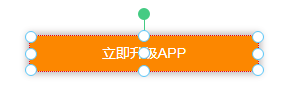
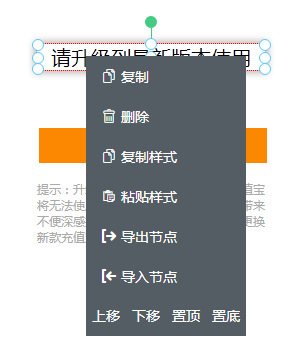

# 组件

组件是构成页面的基础元素，每个组件各自承担着特异的功能，比如图片组件可以呈现一张图片，文本组件可以展示一段文本。一系列组件按照一定的位置和样式排布在页面内，再加以一定的配置，最终就组成了页面。

组件按照抽象的粒度以及功能可以划分为两类：[基础组件](#基础组件)、[合成组件](#合成组件)。

在具体介绍各组件以前，先介绍一下组件相关的信息和操作。

## 组件信息

  直接点击组件上的文字即可在中间的页面操作区显示**组件详情**一栏专门展示组件的信息

  

## 组件操作

### 添加

**方法1.** 直接点击组件。此操作会添加**组件**至**当前激活(选中)组件**的下一级。

**方法2.** 按住组件拖动至**页面操作区某组件**上方。此操作会添加**组件**至**前述某组件**的下级。

### 选中

**方法1.** 点击组件区下方的[组件树](./comtree.html)某节点，节点高亮即该组件被选中

**方法2.** 点击页面操作区某组件，周围出现操作点即该组件被选中

**方法3.** 鼠标**右键**点击操作区某组件。同方法2的区别在于，此操作在选中组件的同时会**打开右键菜单**。

### 缩放

选中组件，按住四面八方8个操作点拖动即可放大缩小，若同时按住 ***shift*** 键，可**按比例**放大缩小，至目标大小，松开鼠标。

### 移动

选中组件，按住**正中的操作点**拖动，即可移动组件，至目标位置，松开鼠标。

### 旋转

选中组件，按住**顶部绿色操作点**环向拖动，即可旋转组件，至目标角度，松开鼠标。

### 删除

**方法1.** 鼠标移至**组件树中待删除组件**上方，出现一排操作按钮，点击垃圾桶状图标即可删除该组件及下级所有组件

**方法2.** 在页面操作区，鼠标右击组件，出现右键菜单，点击“删除”即可删除该组件及下级所有组件

  <video controls name="media" style="max-width: 100%">
    <source src="https://imagecdn.ymm56.com/ymmfile/explore-biz/ymm_1525865011823.mp4" type="video/mp4">
  </video>

### 其他配置和样式

除上述操作外，[组件属性](./attr.html)和样式设置也是制作页面的重要一环。

各个组件的配置项下文会详述，样式设置见后文：[样式](./style.html)。

## 基础组件

基础组件是最基本的页面元素，如按钮、图片、文本、富文本等。下文一一展开说明。

### 按钮

按钮主要用于触发点击事件。

配置项：

- 【按钮文字】输入显示文字

- 【按钮type】根据使用场景，选择不同的按钮主题颜色

- 【点击事件】点击时触发的操作，默认的 **目标对象** 为当前节点（也可点击下拉框选择其他按钮节点来配置点击事件），然后选择点击后对应的方法。

- 【事件管理】可添加多种触发事件方式，如：click、dbclick、change、select、mousemove等。

注意：选择点击操作或配置事件方法时可能需要填写相应操作的参数

  <video controls name="media" style="max-width: 100%">
    <source src="https://imagecdn.ymm56.com/ymmfile/explore-biz/ymm_1526035622353.mp4" type="video/mp4">
  </video>

### 图片

配置项：

- 【图片】 *输入* 图片地址 或 *上传* 图片文件

- 【点击操作】*选择* 点击时触发的操作，同按钮组件

### 文字

配置项：

- 【文字内容】 *输入* 文本内容，文本样式可至**样式-文本样式**设置

- 【点击操作】*选择* 点击时触发的操作，同按钮组件

### 富文本

配置项：

- 【文字内容】 *输入* 文本内容，文本可使用富文本编辑器编辑

### 音频

配置项：

- 【音频】 *输入* 音频地址 或 *上传* 音频文件

- 【音频图标】 *输入* 图片地址 或 *上传* 图片文件，用作音频组件的封面，音频播放状态下自动旋转

- 【自动播放】 *切换* 是否允许音频自动开始播放，注意，暂时对iOS设备无效

- 【显示默认播放按钮】 *切换* 是否显示默认播放控件

- 【循环播放】 *切换* 是否需要循环播放

### 输入框

配置项：

- 【默认值】 *输入* 输入框内默认的内容

- 【占位符】 *输入* 输入框内无内容时显示的文字

- 【类型】 *选择* 输入框输入内容的类型（文本、数字、密码）

- 【只读】 *切换* 输入框是否能被编辑

- 【最多】 *输入* 最多能输入多少个字符，-1为不限

## 组件封装

  <video controls name="media" style="max-width: 100%">
    <source src="https://cos.56qq.com/fis/20200421114307446d3ecd78a0ca5067.mp4" type="video/mp4">
  </video>

上面演示了如何将组件进行封装，组件树中标有小箱子图标的组件就是封装过的组件。被封装的组件在组件树中不再暴露其子孙组件，在场景画布中也不能对子孙组件进行操作，从而形成一个整体。在对封装组件进行缩放操作的时候，子孙组件的大小被等比缩放、位置被线性变换。

组件封装看似简单，带来的改变却是多重的。首先，通过对整个组件树不同功能块进行分别封装，页面结构变得简单清晰；功能块封装以后只暴露出顶层组件，可以有效减少运营人员的误操作，避免因为缺乏必要了解和敬畏之心而随便删改特定功能块的构成组件；功能块封装以后，用户配置参数可以集中在顶层组件（子孙组件使用[数据总线](../develop/script.html#datahub-数据总线)获取配置），配置项不必且不能再四散到组件树各处。

操作上，可以以视频中**右键菜单**的方式进行”解封“和"解除封装"，也可以使用**双击**组件树中目标组件的方式来”解封“和”解封“。

## 合成组件

前面介绍了组件封装，封装后的组件仅限于当前页面复用（复制使用），那么有没有一种方法使封装组件变成普通组件一样，无限制的在其他页面使用呢？答案当然是有，合成组件就是专门干这个的。

### 如何生成合成组件

首先我们的页面都是由组件组成的，组件之间有上下级关系，也有同级关系。那么我们要想生成合成组件，可以直接选择一个层级的组件**右键**打开操作浮层，直接选择**另存为合成组件**即可，接下来我们就可以在左上角的合成组件tab栏来查看我们生成的合成组件，鼠标悬浮在合成组件上点击出现的**使用**按钮即可使用。

### 使用合成组件

切换到合成组件面板（通常在组件面板旁边），搜索你需要的组件，点击使用即可。

实际上，合成组件就是一种封装组件，可以看到在选取使用了合成组件以后，在组件树中仅产生了一个标有小箱子图标的组件。
