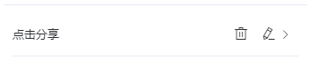
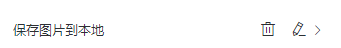

# 脚本

考虑如下场景，向页面添加了10个按钮，点击这些按钮时需要分别记录点击时间、组件id并发送到服务端（即记录点击日志并提交）。需求拆分一下：1. 由于按钮组件本身不具备点击日志记录和发送功能，需要实现此功能；2. 需要为这一组按钮都添加此类似功能。

脚本系统为此而生。

- 脚本可以扩展组件功能。

- 脚本可以被复用。

- 脚本几乎具备完全的组件控制能力，<del>目前唯一的限制是只支持es5语法和特性</del>。

## 使用

该模块提供了脚本库，用户可以自行选择使用；也可以自行开发，生成脚本模版。

## 脚本相关操作

### 保存模版

点击保存脚本模版图标，即可生成新的模版，展示在脚本库里，供其他人员使用。

### 重命名

点击重命名图标，即可重新编辑脚本名称。

### 删除

点击删除图标，即可删除该脚本。

## 开发

除系统提供的组件以外，也可以自己编写脚本。

详细说明见[脚本开发](../develop/script.html)

## 示例

这里具体介绍一下几个常用脚本的使用：

<!-- ### 关联分享组件

向页面内添加分享组件并完成配置后，还需要添加触发组件，这样才能在点击该组件时触发分享操作，这个脚本的功能就是关联这两个组件。

  <video controls name="media" style="max-width: 100%">
    <source src="https://imagecdn.ymm56.com/ymmfile/explore-biz/ymm_1526289299433.mp4" type="video/mp4">
  </video>

 -->

### 项目内部跳转

项目内页面间跳转操作。

  <video controls name="media" style="max-width: 100%">
    <source src="https://imagecdn.ymm56.com/ymmfile/explore-biz/ymm_1526270475490.mp4" type="video/mp4">
  </video>

### 页面容器内部跳转

页面容器内的页面间跳转。

  <video controls name="media" style="max-width: 100%">
    <source src="https://imagecdn.ymm56.com/ymmfile/explore-biz/ymm_1526282241959.mp4" type="video/mp4">
  </video>

<!-- ### 保存图片到本地

保存图片到手机相册。 -->

