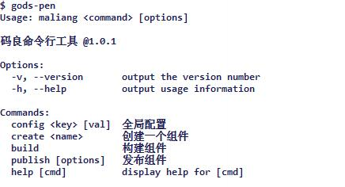

# 组件开发

2020年1月7号开始，官方不提供默认组件，原来的这些组件在 [官方组件仓库](https://github.com/godspencomponent) 组里面，可以自己clone下来。按照下面的教程发布到自己的内部系统中。当然也可以按自己的需求开发和修改。

# 脚手架安装

## `gods-pen`

`gods-pen` 是基于 `nodejs` 的命令行工具，提供了覆盖组件开发全流程的工具，我们一般通过该命令进行 `配置信息`，`创建模板组件`,`构建发布组件`

```shell
npm install gods-pen-cli -g
```



## 设置`registry`

码良是一个开源项目，支持私有部署，当然自己开发的组件也需要部署到你自己的私有服务，因此需要设置`registry`指明向哪个组件仓库来提交组件。

```shell
# 设置为官方组件仓库 godspen.ymm56.com
gods-pen-config registry https://godspen.ymm56.com

# 设置为自己的服务  www.xx.com 可以是域名，可以是ip （该配置配置好后会在publish组件的时候调用 https://www.xx.com/api 下面的接口。`注意这里的域名是你的部署好的码良的访问地址的域名`）
gods-pen-config registry https://www.xx.com
```
## 设置`token`

`token` 即用户凭据，可以在码良后台（左侧菜单-用户设置-access）取得，用来确认开发者身份。如未提供 `token` 则组件不能发布成功。

```shell
gods-pen-config token DEcTjQRFbiYitFydhC2m5kd8JHieQrsztrbiPaz5DbHk68AWbmMBe7ShXw2ncwp5
```

## 创建组件
官方的组件当然满足不了公司内部的业务需求。那么你需要自己开发组件。如何开始呢。就从下面通过脚手架创建组件模板开始。

    gods-pen create my-component

根据提示输入组件名、描述，选择组件分类


项目文件结构如下


可以看到，这是一个典型的 vue 工程。没错，码良组件本身与普通 vue 组件无异，只是在普通 vue 组件的基础上，我们添加了一些约定字段，使组件能被码良编辑器识别、配置。

`/src/index.vue` 即为刚才创建的组件。组件开发的主要工作就是针对这个组件进行功能开发。

`/src/example.vue` 提供了一些简单的代码示例和说明。

`preview/` 目录下的文件是供开发预览使用的，最终发布的时候是不会打包此文件夹文件的，必要时可以按需修改其中的代码，比如测试组件传参（props）。

`icon.png` 将作为组件图标随组件发布至组件仓库，您应该将此文件替换为自己的组件图标。

`[README.md](http://readme.md)` 是组件的详细使用说明，支持 markdown，也会随组件发布上传至组件仓库，在码良编辑器中可以查看组件说明。

不知道你有没有注意到创建组件时，最后一步是选择“是否创建属性配置组件“，所谓属性配置组件就是可以在编辑器中使用此自定义组件来对组件的属性进行配置，而不是使用编辑器默认提供的。`editor/` 文件夹下就是属性配置组件，事实上，无论你选择创建此组件与否，这个文件夹都存在，区别仅在于，选择“是“的时候，webpack `entry` 配置会包含`editor/index.vue` 文件，反之不包含，因此，当你发现自己需要一个自定义属性配置组件而此前未选择“是”的时候，在 `webpack.config.js` 中 `entry` 字段下添加 `editor: './editor/index.vue'` 即可。

## 组件开发

码良组件基于 vue ，在对vue 框架有一定了解后就可以轻松开发码良组件了。


上图中，安装了依赖并启动了项目，简单修改组件展示了“hello world”

下图中我们来开发一个简单的卡片组件，包含一张图片，一行文字，图片和文字可配置


截止目前仍然还是一个普通vue组件的样子，接受两个参数 `img` 和 `line`，如何让编辑器能识别它所需参数并提供合理的输入控件呢，接着看对它的改造


可以看到，我们为`img` 参数和 `line` 参数都添加了一个 `editor` 字段，并指定了 `editor.type` 和 `editor.label` ，`type`为 “image” 代表了编辑器应该为该参数提供一个图片选择器，`label` 为“图片”表示在编辑器中应将该参数显示为“图片”，更多的 `type` 输入类型请参考[文档](https://godspen.ymm56.com/doc/develop/script.html#%E6%B7%BB%E5%8A%A0%E8%87%AA%E5%AE%9A%E4%B9%89%E5%B1%9E%E6%80%A7)。


`/src/index.vue` 即为刚才创建的组件。组件开发的主要工作就是针对这个组件进行功能实现。

若之前选择了“创建属性配置组件”，`/editor/index.vue` 即为属性配置组件。属性配置组件用于在编辑器中自定义组件配置面板。

码良组件本身与普通 vue 组件无异，只是在普通 vue 组件的基础上，我们添加了一些约定字段，使组件能被码良编辑器识别、配置。这些约定字段其实已经在[脚本开发](./script.html)部分介绍过了，见[自定义属性](./script.html#添加自定义属性)、[自定义方法](./script.html#添加自定义方法)

除此以外，我们还内置了一些[工具函数/服务](./script.html#组件实例的通用方法和属性)。

如[过滤器](https://github.com/ymm-tech/gods-pen-cli/blob/master/tpl/preview/lib/vue/filters.js)、[Notice 弹框服务](https://github.com/ymm-tech/gods-pen-cli/blob/master/tpl/preview/app.vue.ejs#L36-L94)、[模板字符串编译](./script.html#模板字符串编译)

对于外部资源的引入，目前有两种方案，一种是通过 `npm` 包引入如

```js
import when from 'when'
```
此种方案使用起来比较方便，但是也有明显的缺点，引入的包会直接被编译到组件内部，可能会造成组件体积过于庞大。

另外还有一种资源引入的方式，资源cdn路径，这种方式需要借助于 `godspen-lib/Util` 的 `loadJs`方法

```js
// godspen-lib 并非是一个真正的 npm 包，在构建时被 webpack 解析为外部依赖，实际访问的是 `window.$GP`对象
import { Util } from 'godspen-lib'
export default {
  mounted: async function () {
    await Util.loadJs('https://cdn.bootcss.com/echarts/4.0.3/echarts.min.js')
  }
}

```

顺便提醒，css预编译默认支持`less` 和 `stylus`，如有其他需求，可自行安装相应 `loader`；媒体资源支持`mp3`、`mp4`、各类型图片、`iconfont`。

## 属性配置组件

前面已经提到过属性配置组件，我们来看一个实现多行多列的格子块组件的例子

组件代码片段如下，

```js
<template>
  <div class="component drumpad">
    // ...
  </div>
</template>

<script>
  import { VueExtend } from 'godspen-lib'

  export default {
    mixins: [VueExtend.mixin],
    name: 'drumpad',
    props: {
      // 为组件定义了三个配置属性
      rows: {
        type: [Number, String],
        editor: {
          label: '行数', // 属性中文名称
          type: 'number' // 使用编辑器预定义输入类型
        }
      },
      cols: {
        type: [Number, String],
        editor: {
          label: '列数', // 属性中文名称
          desc: "设置格子的列数", // 属性描述信息
          type: 'number' // 使用编辑器预定义输入类型
        }
      },
      pads: { // 所有格子的配置信息
        type: Array,
        editor: {
          ignore: true // 在 *属性配置组件* 中实现该属性的输入逻辑和样式
        }
      },
      // ...
    },
    methods: {
      // ...
    }
  }

```

属性配置组件代码片段，

```js

// 属性配置面板配置 `pads` 属性，pads 是一个list，每一个元素对应一个格子的配置，并可以对这些元素进行增、删、复制操作
<template>
  <div class="component-editor">
    <el-card class="box-card">
      <div slot="header" class="clearfix">
        <span>格子块</span>
        <el-button style="float: right; padding: 3px 0;" type="text" @click="addItem">
          添加一个
        </el-button>
        <el-button style="float: right; padding: 3px 0; margin-right:20px;"
          type="text" @click="copyItem"
          v-show="componentInfo.pads && componentInfo.pads.length >= 1">
          复制前一项
        </el-button>
      </div>
      <el-collapse v-show="componentInfo.pads && componentInfo.pads.length">
        <el-collapse-item :title="'格子' + (index + 1)"
          v-for="(item, index) in componentInfo.pads" :key="index">
          <el-form :model="item" label-width="100px" size="mini">
            <el-form-item label="未选中图片">
              <attr-resource type="image" :url.sync="item.deactiveImg"></attr-resource>
            </el-form-item>
            <el-form-item label="选中图片">
              <attr-resource type="image" :url.sync="item.activeImg"></attr-resource>
            </el-form-item>
            <el-form-item label="点击操作">
              <attr-function :content.sync="item.activeAction"></attr-function>
            </el-form-item>
            <el-form-item label="扩展数据">
              <el-input type='textarea' v-model="item.extra"></el-input>
            </el-form-item>
            <el-form-item label="">
              <el-button type="danger" size='medium'
                @click="deleteItem(item, index)">移除当前项</el-button>
            </el-form-item>
          </el-form>
        </el-collapse-item>
      </el-collapse>
    </el-card>
  </div>
</template>

<script>
  export default {
    name: 'maliangeditor',
    props: {
      componentInfo: Object
    },
    methods: {
      // 增加一个格子项
      addItem: function () {
        // 如果不存在 pads 属性，应主动添加响应式属性
        if (!this.componentInfo.pads) this.$set(this.componentInfo, 'pads', [])
        this.componentInfo.pads.push({
          deactiveImg: 'http://iph.href.lu/160x40?text=失活',
          activeImg: 'http://iph.href.lu/160x40?text=激活&fg=FF0000&bg=CCCCCC',
          activeAction: null,
          correlationId: '',
          href: '',
          extra: ''
        })
      },
      // 复制一个格子项
      copyItem () {
        var item = this.componentInfo.pads[this.componentInfo.pads.length - 1]
        if (!item || typeof item !== 'object') return this.addItem()
        this.componentInfo.pads.push(JSON.parse(JSON.stringify(item)))
      },
      // 移除一个格子项
      deleteItem (item, index) {
        this.componentInfo.pads.splice(index, 1)
      }
    }
  }
</script>

```

::: tip
属性配置组件中可直接使用 [element-ui](https://element.eleme.io/#/zh-CN/component/installation) 提供的组件，在组件开发环境已提前引入。
:::

## 构建组件

构建组件是组件发布的前置操作，虽然发布操作会自动构建组件，我们还是提供了构建组件的命令供开发者验证自己的组件是否存在构建方面的问题

```shell
# cd <component-dir>
gods-pen-build
```


## 发布组件

组件发布前，有一些组件配置需要确认。大部分配置集中于工程根目录 `package.json` 文件中，

package.json内 `version` 字段将作为组件版本号，发布组件时，如提示数据库中已有该版本记录，则可能需要修改此版本号

package.json内 `private` 字段指定了组件的可见性，为 `true` 时，仅自己可见，为 `false` 时公开可见。如未提供（为空），在发布组件时，会主动再次询问

package.json内 `label` 字段将作为组件易读名称在编辑器内显示，如未提供，会使用 `name` 字段

package.json内 `description` 字段将作为组件描述，简要说明组件用途

package.json内 `style` 字段定义了组件外层包裹节点的默认样式，决定组件被添加到编辑器时，初始大小、位置等，可为空

根目录 `icon.png` 将作为组件图标展示，请务必提供

根目录 `README.md` 为一个 markdown 文件，将自动编译为 html ，作为组件详细说明文件展示

合理配置上述字段和文件以后，执行发布

如果此前没有设置过组件仓库，请先执行设置命令

    # 设置为官方组件仓库 godspen.ymm56.com
    gods-pen config registry https://godspen.ymm56.com

执行发布（含自动构建）

    gods-pen publish -t [access-token]

其中 `access-token` 请在码良管理后台——用户设置获取。


这就发布成功了，使用一下吧


