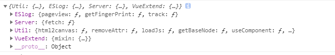

# 脚本开发

```js

return {
  mounted: function () {
    console.log('hello world')
  }
}

```

以上几行代码实现了一个超级简单的脚本！使用了此脚本的组件会在其 `mounted` 生命周期打印出 `hello world`。

所以，如上所示，脚本就是一个 Vue 配置对象(option object)。是的，就是这么简单！

除原生 Vue 配置属性外，我们提供了自定义属性、自定义方法添加方案、以及 `vm.$options.$lib`、数据总线等服务。

## 添加自定义属性

使用脚本添加自定义属性，用户在配置面板配置属性后，脚本可通过组件实例访问到该属性设定值。

支持自定义输入类型、条件属性等。

可复制下文代码为任一组件添加脚本查看效果。

```js

/**
 * 
 * @param type: 字段类型，支持原生类型以及【码良输入类型】
 * 
 * 码良输入类型: 
 * input    单行输入框
 * text     多行输入框
 * enum     列表单选    需提供选项字段defaultList， 支持数组、map结构
 * image    图片选择
 * audio    音频选择
 * video    视频选择
 * richtext 富文本 
 * number   数字
 * function 方法设置
 * data     json数据
 * date     时间选择
 * checkbox 多选框      同enum 不提供defaultList字段时，输入值为布尔类型
 * radio    单选框      同enum
 * 
*/

return {
  props: {
    // 原生类型
    foo: {
      type: String
    },
    // 图片输入
    fooImage: {
      type: String,
      editor: {
        type: 'image'
      }
    },
    // 日期
    fooDate: {
      editor: {
        type: 'date'
      }
    },
    // json数据
    fooData: {
      type: String,
      editor: {
        type: 'data'
      }
    },
    // checkbox 多选
    fooCheckbox: {
      type: Array, // 此项必须为Array
      default: () => { // 且需提供初始值
        return [] // ['day', 'hour', 'min', 'sec']
      },
      editor: {
        label: '显示精度',
        type: 'checkbox',
        defaultList: [ // array 形式的选项
          'day',
          'hour',
          'min',
          'sec',
        ]
      }
    },
    // checkbox 布尔
    fooCheckboxBool: {
      type: Boolean, // 此项必须为Boolean
      editor: {
        type: 'checkbox'
      }
    },
    // enum 含选项
    fooEnum: {
      default: 'value1',
      type: String,
      editor: {
        label: '我是字段名', // 将字段名显示为可读性更强的文本，不提供此项时，显示字段名
        desc: '我是帮助文本', // 为字段提供提示信息，帮助理解字段的意义
        type: 'enum',
        defaultList: { // map结构的选项 key为值，value为显示文本
          'value1': '条件1',
          'value2': '条件2',
          'value3': '条件3',
        }
      }
    },
    // 条件属性
    ifFoo1: {
      type: [Number],
      default: 0,
      editor: {
        work: function () {
          return this.fooEnum == 'value1' // 只有当 `fooEnum` 字段取值为 'value1' 时才显示此项
        },
        label: '条件属性1',
        type: 'number',
      }
    },
    ifFoo2: {
      type: [Date, String],
      default: null,
      editor: {
        work: function () {
          return this.fooEnum == 'value2' // 只有当 `fooEnum` 字段取值为 'value2' 时才显示此项
        },
        label: '条件属性2',
        type: 'date',
      }
    },
  },
  mounted: function () {
    console.log('hello ' + this.foo)
    console.log('hello ' + this.fooImage)
    // ...
  }
}

```

## 添加自定义方法

自定义方法常用于处理回调，响应事件等，添加自定义方法后，用户可在配置面板相应操作选项里选取这个方法，方法在适当时机被调用。

自定义方法能接受传参，在配置面板内输入。

一个典型的自定义方法如下，可在复制代码在码良中验证。

```js

return {
  editorMethods: {              // 此项配置自定义方法的在组件配置面板如何展示
    projectJump: {              // 方法名，对应于 `methods` 内的某方法
      label: '内部跳转',         // 自定义方法显示名
      params: [                 // 参数列表，对象数组  
        {                
          label: '跳转地址',     // 参数1的名称
          desc: '项目相对地址',  // 参数1的描述
          type: 'string',       // 参数1的类型，支持`string|number|boolean|array|object`
          default: ''           // 参数1默认值
        },
        {
          label: '参数',
          desc: 'query形式参数',
          type: 'object',
          default: {}
        }
      ]
    }
  },
  methods:{
    projectJump:function(path,query){
      this.$router.push({
          path:path,
          query:query
      })
    }
  }
}
return node

```

## 组件实例的通用方法和属性

我们在每个组件实例上提供了一些通用方法和属性，使得脚本对可以组件实现更高效、更精确、更全面的控制。

### `vm.$options.$lib`

每个组件实例上添加了 `$lib` 服务，提供了一些工具方法。

```js

return {
  mounted () {
    var lib = this.$options.$lib
    console.log(lib)
  }
}

```




- `ESlog` 提供了 log 上报能力。`ESlog.pageview` 记录页面访问（注意，无需主动调用，每个页面都会默认开启了页面访问日志上报）；`ESlog.track` 自定义事件的日志上报。 详细api可查看[代码](https://github.com/ymm-tech/gods-pen-cli/blob/master/tpl/preview/lib/ESlog.js)。
- `Server` 提供了异步请求能力。`Server.fetch` 使用方法同原生 [`fetch`](https://developer.mozilla.org/zh-CN/docs/Web/API/Fetch_API)。
- `Util` 主要包含 `Util.loadJs` 异步加载js的能力。

### `DataHub` 数据总线

```js

return {
  mounted: {
    // datahub
    // 任意路径 任意值 读写空值不会报错
    // 全局可访问 注意避免无意覆盖
    this.dataHubSet('a.b', 123)
    this.dataHubSet('a.c.d', {k: 15454}) 
    this.dataHubGet('a') // {b: 123}
    this.dataHubGet('a.b') // 123
    this.dataHubGet('a.c.d') // {k: 15454}
    this.dataHubGet('a.c.d.k') // 15454
  }
}

```

### 模板字符串编译

我们提供了通过模板字符串快速访问数据的能力。

对于用户的输入（通过某属性），当检测到形如 `${a.b.c}` 或者 `${$scope.x}`的片段，我们会对其进行编译替换。

形如 `${a.b.c}` 从DataHub取值；形如`${$scope.x}`从上级组件传入该组件的数据中取值，如列表容器传给列表项的数据

模板字符串甚至还支持过滤器，如 `${a.b.c | datatime}`。码良默认提供了一些过滤器，见[过滤器](https://github.com/ymm-tech/gods-pen-cli/blob/master/tpl/preview/lib/vue/filters.js)。也可通过脚本编写自定义过滤器。

编译过程内部调用的方法为 `vm.scopeGet`。

```js

return {
  props: {
    foo: {
      type: String
    }
  },
  mounted: function {
    // 传入 foo 为 '我是示例1 ${a.b.c}'，同时dataHub a.b.c为 123
    this.scopeGet('foo') // '我是示例1 123'
    // 传入 foo 为 '我是列表项 ${$scope.x}'，列表项数据 为 {x: 456}
    this.scopeGet('foo') // '我是列表项 456'
    // 也可复合 但是不能嵌套，this.foo 为 '我是复合 ${a.b.c} ${$scope.x}'
    this.scopeGet('foo') // '我是复合 123 456'
  }
}

```


### 获取其他组件 `getComponent`


如上图所示整个页面都是一个个节点递归组成，每个节点都先有一个空的容器占位，我们叫他`包装容器`，组件配置的style属性都会在这个容器上，决定这容器的位置大小等信息。组件配置的props信息会透传到容器包裹的真正的`组件`里面提供给组件对应的属性值。这里我们要了解如下几个要点：

1. 每个组件包括包装容器，真正的组件其实是在这个包装容器里面。
2. 包装容器接受节点的style控制大小以及动画，组件节点接受props，script，进行组件功能的初始化和扩展
3. 组件如果希望在逻辑中修改props传入的值只能通过获取该元素的包装容器，并通过包装容器里面的nodeInfo.props.xxx 进行修改
4. 我们的逻辑都是在组件，或者在组件扩展的脚本里面。所以我们如果要在逻辑中获取包装容器可以通过 this.$parent 获取包装容器
5. 我们可以通过 `this.$parent.getComponent('xxx')` 获取xxx的包装容器， 可以通过  `this.$parent.getComponent('xxx',true)` 获取包装容器里面的组件

```js

return {
  mounted: function () {
    var anotherComponentId = 'comxxx'
    // 获取包装容器 comxxx
    var anotherWrapComponent = this.$parent.getComponent(anotherComponentId)
    // 修改该节点的nodeInfo等信息
    anotherWrapComponent.nodeInfo.props.xxx = 'xxx'
    // 隐藏元素
    anotherWrapComponent.nodeInfo.visible = false

    // 修改当前节点传入的props值
    this.$praent.nodeInfo.props.xxx = 'xxx'

    // 获取 组件comxxx 对象
    var anotherWrapComponent = this.$parent.getComponent(anotherComponentId,true)
  }
}

```

## 部分官方组件的实例方法和属性

### 音频

```js

return  {
  mounted: function () {
    // 属性 playing
    this.playing

    // 方法 play
    this.play() // 继续播放
    this.play(200) // 时间轴信息
    this.play(0) // 从头播放
    this.play(0) // 从头播放

    // 方法 pause
    this.pause() // 暂停播放

    // 方法 tooglePlaying
    this.tooglePlaying() // 切换播放状态

    // 方法 muted
    this.muted() // 静音

    // 方法 volume 
    this.volume(0.5) // 设置音量 ios无效
  }
}

```

### 列表容器

```js

return  {
  mounted: function () {
    // 计算属性 列表
    this.clist

    // 方法 setList
    this.setList([{a: 1}, {a: 2}]) // 设置数据
  }
}

```
